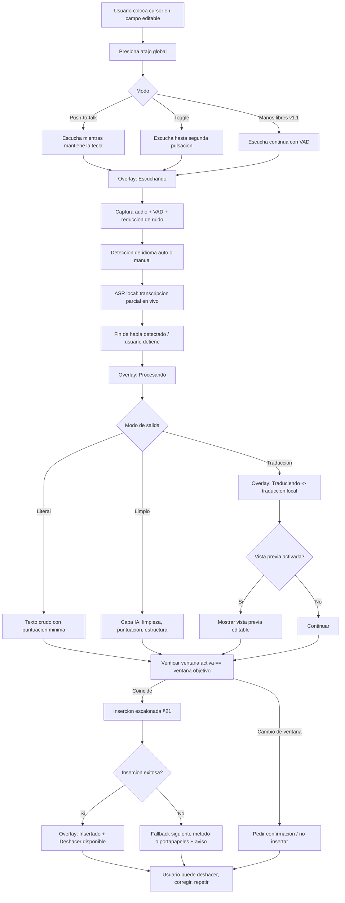
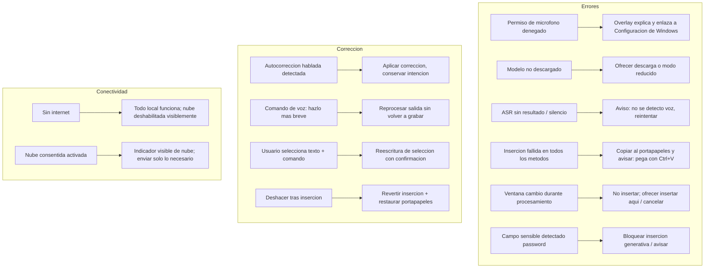
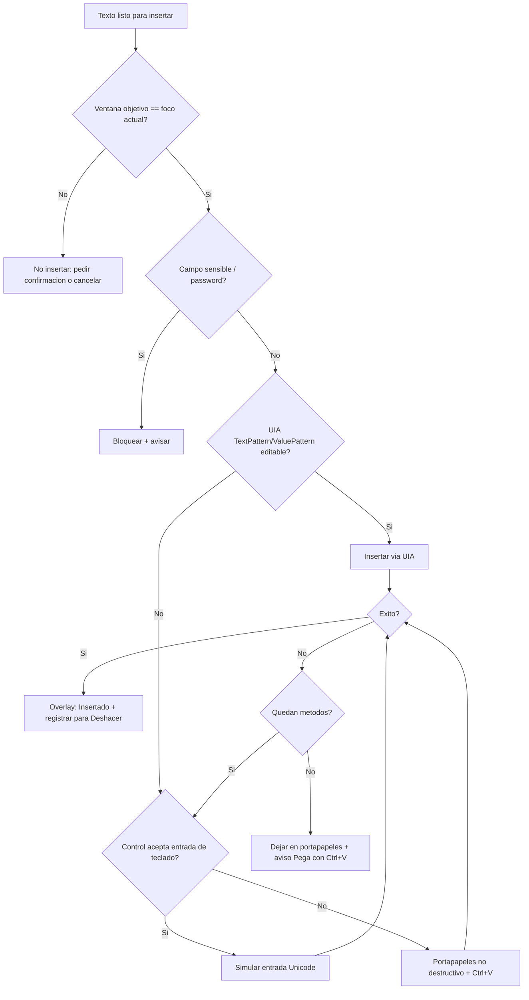
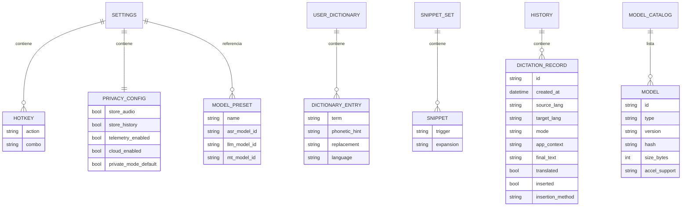

# PRD — Aplicación de Productividad por Voz para Windows (Nombre provisional: **VozLibre**)

> **Nota de renombre:** "VozLibre" fue el nombre provisional usado durante la redacción de este PRD. El producto se llama **LLamaVoz**. El documento se conserva sin reescribir como registro histórico de diseño.

> **Estado del documento:** Borrador ejecutable v0.9 · Windows-first · Local-first
> **Autor(es):** Producto / Arquitectura / ASR / NLP / UX / Seguridad / QA
> **Última actualización:** 2026-07-04
> **Nota de originalidad:** Este producto es una solución independiente. No copia código, marca, interfaz, textos, recursos gráficos, arquitectura propietaria ni propiedad intelectual de Wispr Flow ni de ningún otro producto. Las referencias a "la categoría" se basan únicamente en comportamientos públicos y estándares generales del segmento de dictado inteligente.

---

## Convenciones de etiquetado

A lo largo del documento se usan estas etiquetas:

- **[Confirmado]** — Decisión tomada, no requiere validación adicional para el MVP.
- **[Hipótesis]** — Suposición razonable que dirige el diseño pero debe validarse con datos.
- **[Pendiente de validación]** — Falta información o prueba de concepto antes de comprometerse.
- **Suposición pendiente de validación** — Marca inline sobre datos asumidos.

Prioridad **MoSCoW**: Must / Should / Could / Won't (para este ciclo).

---

## 1. Portada del producto

| Campo | Valor |
|---|---|
| **Nombre provisional** | VozLibre (placeholder, sujeto a búsqueda de marca) **[Pendiente de validación]** |
| **Categoría** | Dictado inteligente y productividad por voz para escritorio |
| **Plataforma inicial** | Windows 11 (x64/ARM64 a validar) · compatibilidad secundaria Windows 10 |
| **Modelo de ejecución** | Local-first, con nube opcional, explícita y consentida |
| **Idiomas MVP** | Español (es), Inglés (en) — transcripción + traducción bidireccional |
| **Distribución** | Instalador descargable firmado para Windows |
| **Público inicial** | Profesionales, desarrolladores, creadores, estudiantes, personas con dificultad para teclear |
| **Principio rector** | Preservar la **intención original** de lo dictado |

---

## 2. Resumen ejecutivo

VozLibre es una aplicación de escritorio residente en la bandeja del sistema de Windows que permite escribir con la voz en prácticamente cualquier campo de texto. El usuario coloca el cursor donde quiere escribir, presiona un atajo global, habla con naturalidad y obtiene texto limpio, puntuado y estructurado insertado en la posición del cursor.

El producto separa dos capacidades:

1. **Transcripción** — voz → texto en el mismo idioma.
2. **Traducción** — voz en un idioma → texto en otro idioma seleccionado.

Sobre la transcripción base opera una **capa de IA local** que limpia muletillas, corrige puntuación y gramática, respeta autocorrecciones habladas, estructura párrafos/listas y adapta el formato al contexto de la aplicación activa — sin añadir información que el usuario no expresó.

La diferenciación central es el enfoque **local-first**: por defecto, audio, transcripción y procesamiento ocurren en la máquina del usuario. La nube es opt-in, visible y reversible. Esto responde a las prioridades de privacidad, funcionamiento sin conexión y control del usuario.

El MVP entrega un flujo confiable de dictado → limpieza → inserción en español e inglés, con traducción bidireccional, diccionario personal, overlay de estado, controles de privacidad y una estrategia escalonada de inserción de texto que degrada con elegancia cuando una aplicación no expone sus controles.

**Riesgo principal a validar antes del desarrollo completo:** la fiabilidad de la inserción universal de texto en aplicaciones heterogéneas de Windows (UI Automation vs. simulación de entrada vs. portapapeles) y la latencia/calidad de los modelos locales de ASR y LLM en hardware de gama media. Ambos requieren pruebas de concepto (ver §34).

---

## 3. Visión del producto

**Visión:** que hablar sea una forma de escribir tan natural, rápida y confiable como teclear — en cualquier aplicación, respetando la privacidad como valor por defecto y no como una casilla oculta.

**Estado futuro deseado (18–24 meses, no compromiso):**

- El usuario piensa en voz alta y obtiene texto listo para enviar, sin editar.
- El sistema entiende el contexto (correo vs. terminal vs. chat) y adapta el formato.
- Todo funciona sin conexión por defecto; la nube es una elección informada para casos concretos.
- La accesibilidad es de primera clase: el producto reduce el dolor y la barrera de teclear.

**Anti-visión:** no somos un servicio en la nube que "también" tiene modo local; no capturamos audio de forma opaca; no transformamos el dictado en contenido distinto de la intención del usuario; no prometemos compatibilidad universal sin pruebas.

---

## 4. Problema y oportunidad

### 4.1 El problema

Escribir con teclado es lento, físicamente costoso y propenso a interrupciones de flujo:

- **Velocidad:** el habla natural (≈120–150 ppm) supera con holgura la escritura media a teclado (≈40 ppm). **Suposición pendiente de validación** (cifras de referencia general, no medidas en nuestros usuarios).
- **Carga física:** lesiones por esfuerzo repetitivo, dolor, fatiga; usuarios con movilidad reducida quedan excluidos o ralentizados.
- **Fricción de contexto:** cambiar entre idiomas, adaptar tono formal/informal, estructurar en listas o párrafos, corregir puntuación — todo consume atención que debería ir al contenido.
- **Cambio de aplicación:** las soluciones de dictado atadas a una app (o a la nube) obligan a copiar/pegar entre ventanas, rompiendo el flujo.

### 4.2 Por qué el dictado tradicional resulta insuficiente

- El dictado nativo del SO suele producir texto **literal**: sin limpieza de muletillas, con puntuación pobre y sin adaptación al contexto.
- No respeta **autocorrecciones habladas** ("reunión el martes… no, el miércoles").
- No estructura ideas ("primero… segundo… tercero" → lista).
- No traduce en el mismo gesto.
- Con frecuencia depende de la nube, con implicaciones de privacidad y de funcionamiento offline.

### 4.3 Por qué la corrección contextual + inserción universal aportan valor

- **Corrección contextual:** el valor no está solo en transcribir, sino en entregar texto **listo para usar** en el contexto correcto (un correo formal, un mensaje breve, un comentario de código).
- **Inserción universal:** el texto aparece donde está el cursor, sin copiar/pegar manual, en la app que el usuario ya está usando.

### 4.4 Por qué local-first diferencia el producto

- **Privacidad verificable:** el audio y el texto no salen de la máquina por defecto.
- **Offline real:** funciona en aviones, redes restringidas, entornos corporativos sin salida a internet.
- **Latencia:** sin ida/vuelta de red para el caso base.
- **Costo:** sin costo marginal por minuto de nube en el flujo por defecto.

**Oportunidad:** un segmento creciente de usuarios sensibles a privacidad (desarrolladores, sector salud/legal, corporativo) y de usuarios con necesidades de accesibilidad, mal atendidos por soluciones nube-first.

---

## 5. Objetivos

**Objetivos de producto (MVP):**

1. Permitir dictado por voz insertado en la posición del cursor en las aplicaciones objetivo de la matriz de compatibilidad (§27).
2. Ofrecer transcripción local es/en con limpieza y puntuación automática.
3. Ofrecer traducción es↔en tras la transcripción, con vista previa opcional.
4. Garantizar privacidad por defecto: sin almacenamiento de audio, sin telemetría de contenido, nube opt-in.
5. Latencia percibida baja y experiencia discreta desde la bandeja del sistema.
6. Estrategia de inserción escalonada con recuperación ante fallos, sin destruir contenido existente.

**Objetivos de negocio (dirección, no compromiso):**

- Validar la disposición a pagar por privacidad + calidad local en una beta cerrada.
- Establecer una base técnica (modelos, inserción, actualizaciones) reutilizable para futuras plataformas.

**No metas cuantitativas cerradas aquí:** los umbrales viven en §31 como **[Hipótesis]** a validar.

---

## 6. No objetivos

- **No** ser un asistente conversacional general ni ejecutar acciones en el sistema por voz (abrir apps, mandar correos automáticamente) en el MVP.
- **No** soportar más de dos idiomas en el MVP (es/en).
- **No** ofrecer colaboración en tiempo real, cuentas en la nube ni sincronización multi-dispositivo en el MVP.
- **No** garantizar compatibilidad universal con todas las aplicaciones de Windows.
- **No** operar en macOS/Linux/móvil en este ciclo.
- **No** realizar diarización de múltiples hablantes ni transcripción de reuniones/llamadas en el MVP.
- **No** convertir el dictado en contenido distinto de la intención expresada (nunca como comportamiento por defecto).
- **No** usar datos del usuario para entrenar modelos (nunca sin consentimiento explícito).

---

## 7. Suposiciones

| # | Suposición | Etiqueta |
|---|---|---|
| S-01 | El usuario objetivo tiene Windows 11 y hardware de gama media (≥16 GB RAM, CPU moderna; GPU opcional). | Suposición pendiente de validación |
| S-02 | Un modelo ASR local de tamaño moderado alcanza calidad aceptable es/en en dictado de campo cercano. | [Hipótesis] |
| S-03 | Un LLM pequeño local (cuantizado) puede realizar limpieza/puntuación con latencia aceptable en CPU/GPU de consumo. | [Hipótesis] |
| S-04 | UI Automation cubre una fracción mayoritaria de campos de texto objetivo; el resto se cubre con fallback de teclado/portapapeles. | [Pendiente de validación] |
| S-05 | Los usuarios aceptan descargar modelos (cientos de MB a algunos GB) en el onboarding. | [Hipótesis] |
| S-06 | La traducción local es↔en de calidad "buena para comunicación" es alcanzable con modelos de tamaño moderado. | [Hipótesis] |
| S-07 | La mayoría de casos de uso son de campo cercano (micrófono a <1 m), no de sala. | [Hipótesis] |
| S-08 | El usuario acepta un atajo global que pueda entrar en conflicto y ofrecer reconfiguración. | [Confirmado] (diseño lo contempla) |

---

## 8. Usuarios y personas

Se definen 5 personas. La sensibilidad de datos y las apps objetivo guían prioridades de inserción y privacidad.

### Persona 1 — Diego, Desarrollador de software

- **Contexto:** trabaja en IDE, terminal, PRs, chats de equipo; bilingüe es/en.
- **Necesidad principal:** dictar comentarios de código, mensajes de commit, PRs, prompts para herramientas de IA, y traducir mensajes al inglés.
- **Frustraciones actuales:** el dictado nativo mete puntuación mala en terminal; copiar/pegar rompe flujo; privacidad de código propietario.
- **Frecuencia:** varias veces por hora.
- **Apps:** VS Code, Visual Studio, Windows Terminal, PowerShell, Chrome (ChatGPT), Slack, GitHub.
- **Sensibilidad de datos:** **Alta** (código propietario, credenciales). Local-first es requisito, no lujo.
- **Resultado esperado:** texto técnico correcto, sin autocorrección agresiva de nombres/símbolos, sin fuga a la nube.

### Persona 2 — María, Consultora / Profesional de negocio

- **Contexto:** redacta muchos correos y mensajes, a menudo formales, es/en.
- **Necesidad principal:** convertir ideas habladas en correos bien estructurados y traducir al inglés manteniendo tono.
- **Frustraciones:** reescribir para que suene profesional; cambiar de idioma; puntuación.
- **Frecuencia:** decenas de veces al día.
- **Apps:** Outlook, Word, Teams, Chrome (Gmail, Google Docs), Notion.
- **Sensibilidad:** **Media-alta** (información de clientes).
- **Resultado esperado:** correo listo para enviar, tono adaptable, traducción fiel.

### Persona 3 — Sofía, Creadora de contenido / Estudiante

- **Contexto:** toma notas, redacta borradores, estudia en dos idiomas.
- **Necesidad principal:** capturar ideas rápido, estructurarlas, resumir/expandir.
- **Frustraciones:** perder ideas por lentitud al teclear; organizar pensamientos.
- **Frecuencia:** varias veces al día.
- **Apps:** Notion, Google Docs, Word, navegador.
- **Sensibilidad:** **Media**.
- **Resultado esperado:** notas limpias y estructuradas; poder pedir "hazlo más breve" o "conviértelo en lista".

### Persona 4 — Carlos, Usuario con dolor/lesión al teclear (accesibilidad)

- **Contexto:** RSI / dolor de muñecas; teclear le causa dolor.
- **Necesidad principal:** reducir al mínimo el uso del teclado en todas sus tareas.
- **Frustraciones:** el dolor limita su productividad; el dictado nativo es poco fiable e inserta mal.
- **Frecuencia:** continua (su principal método de entrada).
- **Apps:** todo el rango — correo, documentos, navegador, chat.
- **Sensibilidad:** **Media** (personal).
- **Resultado esperado:** fiabilidad y modo manos libres; atajos accesibles; no depender de precisión motriz fina.

### Persona 5 — Elena, Profesional en entorno regulado (salud/legal)

- **Contexto:** maneja datos confidenciales de terceros; cumplimiento estricto.
- **Necesidad principal:** dictar notas y documentos sin que el contenido salga del equipo.
- **Frustraciones:** las soluciones nube-first son inaceptables por cumplimiento.
- **Frecuencia:** diaria.
- **Apps:** Word, sistemas internos (campos estándar de Windows / navegador).
- **Sensibilidad:** **Muy alta** (datos regulados).
- **Resultado esperado:** garantía verificable de procesamiento 100% local, modo privado de cero retención, auditoría de qué se almacena.

---

## 9. Jobs to Be Done (JTBD)

- Cuando **tengo una idea clara pero teclear es lento o doloroso**, quiero **dictarla y obtener texto listo**, para **avanzar sin fricción física ni de flujo**.
- Cuando **escribo a alguien en otro idioma**, quiero **hablar en el mío y que se inserte en el suyo**, para **comunicarme sin cambiar de herramienta**.
- Cuando **redacto algo formal**, quiero **que mi habla informal se estructure y pula**, para **no reescribir**.
- Cuando **manejo información sensible**, quiero **garantía de que nada sale de mi equipo**, para **cumplir y confiar**.
- Cuando **estoy en una app técnica (IDE/terminal)**, quiero **texto literal sin "corrección" que rompa símbolos**, para **no arreglar lo que la IA cambió**.
- Cuando **me equivoco al hablar**, quiero **corregirme en voz alta y que el sistema lo entienda**, para **no editar después**.

---

## 10. Casos de uso

| ID | Caso de uso | Persona típica | Modo esperado |
|---|---|---|---|
| UC-01 | Redactar un correo formal en Outlook | María | Texto limpio + adaptación de tono |
| UC-02 | Escribir un mensaje rápido en Teams/Slack/Discord | Todas | Texto limpio breve |
| UC-03 | Crear/editar un documento en Word/Google Docs/Notion | Sofía, María | Texto limpio + estructura |
| UC-04 | Dictar un prompt para ChatGPT en navegador | Diego | Texto limpio, fiel |
| UC-05 | Escribir comentarios/documentación de código en VS Code | Diego | Modo literal / mínima corrección |
| UC-06 | Comandos en Windows Terminal/PowerShell | Diego | Dictado literal, sin puntuación agresiva |
| UC-07 | Tomar notas rápidas | Sofía, Carlos | Texto limpio + listas |
| UC-08 | Traducir un mensaje al inglés antes de enviarlo | María, Diego | Traducción + vista previa |
| UC-09 | Reescribir/corregir texto ya seleccionado ("hazlo más formal") | María, Sofía | Reescritura de selección |
| UC-10 | Trabajar manos libres por dolor al teclear | Carlos | Manos libres |
| UC-11 | Dictar datos confidenciales | Elena | Modo privado, cero retención, sin nube |
| UC-12 | Convertir una idea hablada en una lista estructurada | Sofía | Comando de IA |

---

## 11. Propuesta de valor

**Para** profesionales, desarrolladores, creadores, estudiantes y personas con dificultad para teclear
**que** necesitan escribir mucho, rápido, en varios idiomas y a veces con información sensible,
**VozLibre** es una app de dictado inteligente para Windows
**que** convierte tu voz en texto limpio, corregido y traducido, insertado directamente donde escribes, funcionando por defecto 100% en tu equipo.
**A diferencia de** las soluciones de dictado atadas a la nube o a una sola aplicación,
**nuestro producto** prioriza privacidad verificable (local-first), inserción universal con recuperación ante fallos, y preservación estricta de tu intención.

---

## 12. Principios del producto

1. **Privacidad y control del usuario primero.** Local por defecto; nube solo con consentimiento explícito y visible.
2. **Preservar la intención.** Nunca añadir hechos ni cambiar el significado; la limpieza es cosmética y estructural, no inventiva.
3. **Inserción no destructiva.** Nunca borrar/reemplazar contenido sin acción explícita del usuario.
4. **Degradar con elegancia.** Si un método de inserción o un modelo falla, ofrecer alternativa clara, no un error opaco.
5. **Discreto y rápido.** Overlay no intrusivo; latencia baja; vive en la bandeja.
6. **Configurable ante compromisos.** Cuando exactitud y velocidad choquen, exponer el compromiso y ofrecer modos.
7. **Transparencia.** El usuario siempre sabe si algo va a la nube, qué se almacena y cómo borrarlo.
8. **Accesibilidad de primera clase.** Teclado, lectores de pantalla, contraste; el producto reduce barreras, no las crea.
9. **Mínimo privilegio y mínimo almacenamiento.** Pedir solo los permisos necesarios; guardar lo mínimo.

---

## 13. Alcance del MVP

**MoSCoW = Must**, salvo indicación.

- Aplicación de escritorio para Windows 11, residente en **bandeja del sistema**.
- **Atajo global** configurable (push-to-talk y toggle).
- **Captura de micrófono** con selección de dispositivo y **VAD** (detección de actividad de voz).
- **Transcripción local** es/en con detección de idioma (auto o manual).
- **Corrección y puntuación** por capa de IA local (limpieza de muletillas configurable, capitalización, párrafos).
- **Traducción local es↔en** tras transcripción, con **vista previa opcional**.
- **Inserción de texto** en aplicaciones comunes con estrategia escalonada (§21) y **deshacer**.
- **Overlay de estado** (escuchando / procesando / traduciendo / insertado / error).
- **Configuración básica** (atajos, micrófono, idioma, modo, privacidad).
- **Diccionario personal** (nombres propios, términos técnicos).
- **Modo literal** (sin procesamiento generativo) para situaciones sensibles y para terminal/IDE.
- **Reescritura de selección** por comando de voz/atajo (Should para MVP; ver FR).
- **Controles de privacidad:** sin almacenamiento de audio por defecto, historial desactivable, botón de borrado total, modo privado.
- **Registro local de errores** sin contenido sensible.
- **Gestión de modelos** (descarga inicial, verificación de integridad) y **funcionamiento offline**.
- **Actualizaciones automáticas seguras** (Should para MVP; puede ser manual firmado en beta).

**Fuera del MVP pero mencionado:** modo manos libres continuo (Should), snippets por voz (Could), personalización avanzada de estilo (Could).

---

## 14. Funcionalidades posteriores

### Versión 1.1

- **Modo manos libres** robusto (escucha continua con gestión de energía y falsos positivos).
- **Snippets/atajos de texto** activados por voz.
- **Personalización de estilo** (perfiles de tono por aplicación).
- Más comandos de IA (resumir, expandir, formalizar) con UI dedicada.
- **Procesamiento híbrido opcional** (nube consentida) para calidad superior de traducción/limpieza.
- Historial enriquecido con búsqueda local.
- Mejora de la matriz de compatibilidad tras datos de beta.

### Versión 2

- Idiomas adicionales (según demanda; p. ej. pt, fr, de).
- Adaptación/aprendizaje del vocabulario del usuario (local).
- Perfiles por aplicación más ricos; reglas contextuales.
- Comandos de voz avanzados y macros.
- Posible plataforma adicional (evaluación).
- Sincronización cifrada opcional de diccionario/ajustes (opt-in).

### Fuera de alcance inicial (§15)

---

## 15. Funcionalidades fuera de alcance

- Transcripción de reuniones/llamadas y diarización de múltiples hablantes.
- Asistente conversacional general / ejecución de acciones del sistema por voz.
- Edición de documentos por comandos complejos ("mueve el tercer párrafo arriba").
- Colaboración multiusuario en tiempo real.
- Cuentas obligatorias / SSO empresarial (evaluable como opción futura).
- Móvil, macOS, Linux (este ciclo).
- Traducción de más de 2 idiomas en MVP.

---

## 16. Flujo principal del usuario

**Narrativa:** cursor en campo editable → mantener/pulsar atajo → overlay "escuchando" → hablar → soltar/pulsar → overlay "procesando" (transcripción + IA) → (opcional "traduciendo") → inserción en cursor → confirmación breve → deshacer disponible.



---

## 17. Flujos alternativos



---

## 18. Requisitos funcionales

> Formato por requisito: Nombre · Descripción · Actor · Precondiciones · Flujo principal · Flujos alternativos · Resultado esperado · Prioridad (MoSCoW) · Criterios de aceptación (Given/When/Then) · Dependencias · Riesgos/casos límite.

### Onboarding y permisos

#### FR-001 — Instalación y primer arranque
- **Descripción:** instalador firmado; primer arranque lanza onboarding.
- **Actor:** usuario nuevo. **Precondiciones:** Windows 11 compatible.
- **Flujo principal:** ejecutar instalador → aceptar → app inicia → onboarding.
- **Alternativos:** instalación sin privilegios de admin (per-user); fallo de firma → bloquear.
- **Resultado:** app instalada, en bandeja, onboarding visible.
- **Prioridad:** Must.
- **Criterios:**
  - Given un instalador firmado, When el usuario lo ejecuta, Then la app queda instalada por usuario sin requerir admin y aparece en la bandeja.
  - Given firma inválida/corrupta, When se intenta instalar, Then el sistema/instalador lo rechaza y muestra motivo.
- **Dependencias:** firma de código (§25). **Riesgos:** SmartScreen/AV falsos positivos.

#### FR-002 — Solicitud de permisos (micrófono)
- **Descripción:** solicitar acceso a micrófono de forma transparente, con explicación.
- **Actor:** usuario. **Precondiciones:** app instalada.
- **Flujo:** onboarding explica por qué → invoca permiso del SO → confirma estado.
- **Alternativos:** permiso denegado → pantalla con pasos para habilitar en Configuración de Windows; app funciona en estado limitado (sin captura).
- **Resultado:** estado de permiso conocido y comunicado.
- **Prioridad:** Must.
- **Criterios:**
  - Given onboarding, When se solicita micrófono, Then se muestra explicación antes del prompt del SO.
  - Given permiso denegado, When el usuario intenta dictar, Then se muestra guía accionable y no se captura audio.
- **Dependencias:** APIs de audio de Windows. **Riesgos:** políticas de privacidad de Windows por app.

#### FR-003 — Descarga y verificación de modelos
- **Descripción:** descargar modelos ASR/LLM/traducción locales con verificación de integridad.
- **Actor:** usuario. **Precondiciones:** espacio en disco, red (solo para descarga).
- **Flujo:** onboarding recomienda modelos según hardware → descarga con progreso → verifica hash/firma → activa.
- **Alternativos:** sin red → posponer, permitir uso posterior; hash inválido → rechazar y reintentar; disco insuficiente → avisar.
- **Resultado:** modelos válidos instalados y verificados.
- **Prioridad:** Must.
- **Criterios:**
  - Given una descarga de modelo, When finaliza, Then se verifica su hash/firma antes de habilitarlo; si falla, no se usa.
  - Given falta de red, When el usuario continúa, Then puede completar la descarga más tarde y la app lo indica.
- **Dependencias:** repositorio de modelos, catálogo firmado. **Riesgos:** tamaño de descarga, integridad (§33/§8 amenazas).

### Configuración de entrada

#### FR-004 — Selección de micrófono
- **Descripción:** elegir entre micrófonos disponibles (USB, Bluetooth, integrado).
- **Actor:** usuario. **Precondiciones:** permiso concedido.
- **Flujo:** Configuración → lista de dispositivos → seleccionar → prueba de nivel.
- **Alternativos:** dispositivo desconectado → fallback a predeterminado del SO + aviso; Bluetooth con latencia → advertir.
- **Resultado:** dispositivo activo confirmado.
- **Prioridad:** Must.
- **Criterios:**
  - Given varios micrófonos, When el usuario selecciona uno, Then la captura usa ese dispositivo y muestra medidor de nivel.
  - Given desconexión del dispositivo activo, When ocurre, Then la app avisa y recurre al predeterminado.
- **Dependencias:** enumeración de dispositivos de audio. **Riesgos:** conmutación de perfil Bluetooth (HFP/A2DP) degrada calidad.

#### FR-005 — Atajos globales configurables
- **Descripción:** registrar atajos globales para push-to-talk, toggle y (v1.1) manos libres.
- **Actor:** usuario. **Precondiciones:** app en ejecución.
- **Flujo:** Configuración → asignar combinación → detectar conflicto → guardar.
- **Alternativos:** conflicto con atajo del SO/otra app → advertir y sugerir alternativa; registro fallido → mantener anterior.
- **Resultado:** atajo funcional globalmente.
- **Prioridad:** Must.
- **Criterios:**
  - Given un atajo asignado, When el usuario lo pulsa en cualquier app, Then se activa la escucha.
  - Given un conflicto conocido, When el usuario lo asigna, Then se muestra advertencia antes de guardar.
- **Dependencias:** registro de hotkeys de Windows. **Riesgos:** apps elevadas capturan/roban el atajo (ver §20).

#### FR-006 — Modos de activación (push-to-talk / toggle)
- **Descripción:** mantener para hablar; o pulsar para iniciar y pulsar para detener.
- **Actor:** usuario. **Prioridad:** Must.
- **Criterios:**
  - Given modo push-to-talk, When el usuario mantiene la tecla, Then escucha mientras se mantenga y procesa al soltar.
  - Given modo toggle, When pulsa una vez, Then escucha hasta la segunda pulsación.
- **Riesgos:** tecla "pegada" si se pierde el evento de soltar → timeout de seguridad.

#### FR-007 — Modo manos libres
- **Descripción:** escucha continua con VAD; segmenta por pausas.
- **Actor:** usuario (Carlos). **Prioridad:** Should (objetivo v1.1).
- **Criterios:**
  - Given manos libres activo, When el usuario hace una pausa larga, Then se cierra el segmento y se procesa.
  - Given ruido ambiente, When no hay voz, Then no se generan transcripciones espurias (umbral de VAD).
- **Riesgos:** falsos positivos, consumo de energía; **[Pendiente de validación]** en beta.

### Captura e interpretación

#### FR-008 — Detección de actividad de voz (VAD)
- **Descripción:** detectar inicio/fin de habla y pausas para segmentar.
- **Prioridad:** Must.
- **Criterios:**
  - Given inicio de habla, When el usuario empieza a hablar, Then el overlay refleja actividad.
  - Given pausa de fin configurable, When se supera, Then se finaliza el segmento (en modos aplicables).

#### FR-009 — Reducción de ruido
- **Descripción:** reducir ruido de fondo antes/junto al ASR.
- **Prioridad:** Should.
- **Criterios:**
  - Given ruido moderado, When el usuario dicta, Then la WER no se degrada por debajo del umbral objetivo (§31) frente a entorno silencioso. **[Hipótesis]**
- **Riesgos:** sobre-supresión que recorta voz.

#### FR-010 — Detección automática de idioma
- **Descripción:** detectar es/en automáticamente o permitir fijarlo.
- **Prioridad:** Must.
- **Criterios:**
  - Given detección automática, When el usuario habla en es o en, Then el idioma se identifica correctamente ≥ umbral (§31).
  - Given idioma fijado manualmente, When el usuario lo fija, Then se respeta aunque la detección difiera.
- **Riesgos:** cambio de idioma intra-frase (code-switching) → ver modo bilingüe (Could MVP).

#### FR-011 — Transcripción parcial en vivo
- **Descripción:** mostrar transcripción parcial durante el dictado (streaming).
- **Prioridad:** Should.
- **Criterios:**
  - Given dictado en curso, When el usuario habla, Then aparece texto parcial con latencia ≤ umbral (§31).
- **Riesgos:** parciales inestables ("flicker"); no insertar parciales, solo mostrar.

#### FR-012 — Transcripción final
- **Descripción:** producir transcripción final tras finalizar el habla.
- **Prioridad:** Must.
- **Criterios:**
  - Given fin de dictado, When se procesa, Then se entrega texto final consolidado.
- **Dependencias:** FR-003 (modelo ASR).

#### FR-013 — Puntuación y capitalización automáticas
- **Descripción:** añadir puntuación y mayúsculas coherentes.
- **Prioridad:** Must.
- **Criterios:**
  - Given una frase dictada sin decir signos, When se procesa en modo limpio, Then el resultado incluye puntuación/capitalización correctas ≥ umbral (§31).
  - Given modo literal, When se procesa, Then no se aplica corrección generativa (puntuación mínima o hablada).

#### FR-014 — Eliminación configurable de muletillas
- **Descripción:** quitar "eh", "este", "o sea", etc., según preferencia.
- **Prioridad:** Should.
- **Criterios:**
  - Given eliminación activada, When el usuario dice muletillas, Then se omiten sin alterar el significado.
  - Given desactivada, When dicta, Then se conservan.

#### FR-015 — Detección de autocorrecciones habladas
- **Descripción:** interpretar correcciones verbales ("el martes, no, el miércoles").
- **Prioridad:** Should.
- **Criterios:**
  - Given una autocorrección hablada, When se procesa, Then el texto final refleja la versión corregida, preservando la intención.
- **Riesgos:** falsos positivos que borren contenido válido; conservador por defecto.

#### FR-016 — Conservación del significado original
- **Descripción:** invariante transversal: nunca añadir hechos ni cambiar el sentido.
- **Prioridad:** Must (principio §12).
- **Criterios:**
  - Given cualquier procesamiento de IA, When produce salida, Then no introduce afirmaciones, datos ni entidades no presentes en el dictado.
- **Verificación:** conjunto de pruebas con casos "trampa" (§35).

#### FR-017 — Vocabulario técnico / nombres propios / diccionario personal
- **Descripción:** soportar términos personalizados que el ASR/IA debe respetar.
- **Prioridad:** Must (diccionario básico).
- **Criterios:**
  - Given un término en el diccionario, When aparece en el habla, Then se transcribe con la forma definida.
  - Given un nombre propio, When se dicta, Then no se "corrige" a una palabra común.
- **Dependencias:** integración diccionario ↔ ASR/post-proceso.

#### FR-018 — Snippets activados por voz
- **Descripción:** frases-gatillo que expanden a texto predefinido.
- **Prioridad:** Could (v1.1).
- **Criterios:**
  - Given un snippet "mi firma", When el usuario lo dice, Then se inserta el texto asociado.

### Traducción

#### FR-019 — Traducción tras transcripción (es↔en)
- **Descripción:** traducir el texto transcrito al idioma de salida configurado.
- **Actor:** usuario. **Precondiciones:** idioma de salida definido; modelo de traducción disponible.
- **Flujo:** transcribir → traducir → (vista previa opcional) → insertar.
- **Alternativos:** modelo no disponible → ofrecer alternativa/nube consentida/omitir; calidad baja → permitir editar en vista previa.
- **Prioridad:** Must.
- **Criterios:**
  - Given idioma de salida = inglés y habla en español, When se procesa, Then se inserta texto en inglés.
  - Given nombres propios/cifras/terminología, When se traduce, Then se preservan sin alterarse.
- **Dependencias:** FR-012, modelo de traducción. **Riesgos:** calidad local (§34 POC).

#### FR-020 — Vista previa de traducción
- **Descripción:** mostrar el texto traducido editable antes de insertar.
- **Prioridad:** Should.
- **Criterios:**
  - Given vista previa activada, When hay traducción, Then el usuario puede revisar/editar y confirmar antes de insertar.

#### FR-021 — Modo bilingüe (code-switching)
- **Descripción:** alternar idiomas dentro de una sesión.
- **Prioridad:** Could (MVP), Should (v1.1).
- **Criterios:**
  - Given modo bilingüe, When el usuario mezcla es/en, Then el sistema maneja el cambio sin fallar (calidad mejor en v1.1).

### Procesamiento de IA y comandos

#### FR-022 — Limpieza y estructura por IA
- **Descripción:** limpiar texto, dividir en párrafos, convertir enumeraciones habladas en listas.
- **Prioridad:** Must.
- **Criterios:**
  - Given "primero X segundo Y tercero Z", When modo limpio, Then se produce una lista de 3 elementos.
  - Given un monólogo largo, When se procesa, Then se divide en párrafos coherentes sin alterar el contenido.

#### FR-023 — Comandos de voz de reprocesado
- **Descripción:** interpretar comandos como "hazlo más breve", "tradúcelo al inglés", "conviértelo en lista", "más formal".
- **Prioridad:** Should.
- **Criterios:**
  - Given un resultado previo, When el usuario dice "hazlo más breve", Then se acorta sin volver a grabar y sin perder la intención.
  - Given comando "tradúcelo al inglés", When se emite, Then se traduce el texto actual.
- **Riesgos:** distinguir comando de contenido dictado (§8 abuso de comandos); requiere convención clara (p. ej. modo comando).

#### FR-024 — Reescritura de texto seleccionado
- **Descripción:** transformar texto ya seleccionado en la app mediante voz/atajo.
- **Actor:** usuario. **Precondiciones:** texto seleccionado y accesible por UIA/portapapeles.
- **Flujo:** seleccionar → invocar → dictar comando → vista previa/confirmación → reemplazo.
- **Alternativos:** no se puede leer la selección → avisar; reemplazo destructivo → requiere confirmación explícita.
- **Prioridad:** Should.
- **Criterios:**
  - Given texto seleccionado y comando "más formal", When se confirma, Then el texto seleccionado se reemplaza por la versión formal.
  - Given no confirmación, When el usuario cancela, Then no se modifica nada.
- **Riesgos:** obtener la selección de forma fiable varía por app.

#### FR-025 — Adaptación de formato al contexto de la app
- **Descripción:** ajustar el estilo/formato según la app activa (correo vs. chat vs. terminal).
- **Prioridad:** Should (heurística básica en MVP).
- **Criterios:**
  - Given app = Windows Terminal/PowerShell, When se dicta, Then se usa modo literal por defecto (sin puntuación agresiva).
  - Given app = Outlook, When se dicta, Then se favorece texto estructurado tipo correo.
- **Dependencias:** identificación de app activa (§20).

### Inserción y edición

#### FR-026 — Inserción universal escalonada
- **Descripción:** insertar en el cursor con estrategia por niveles (§21).
- **Prioridad:** Must.
- **Criterios:**
  - Given un control editable estándar, When se inserta, Then el texto aparece en el cursor sin borrar contenido existente.
  - Given fallo del método primario, When ocurre, Then se intenta el siguiente método automáticamente.
- **Dependencias:** UIA, simulación de entrada, portapapeles.

#### FR-027 — Gestión no destructiva del portapapeles
- **Descripción:** si se usa portapapeles como método, respaldar y restaurar su contenido.
- **Prioridad:** Must.
- **Criterios:**
  - Given uso del portapapeles para insertar, When finaliza, Then el contenido previo del portapapeles se restaura.
  - Given restauración imposible, When ocurre, Then se avisa al usuario.
- **Riesgos:** contenido de portapapeles no textual; condiciones de carrera con gestores de portapapeles.

#### FR-028 — Verificación de ventana objetivo
- **Descripción:** confirmar que la ventana activa sigue siendo la objetivo antes de insertar.
- **Prioridad:** Must.
- **Criterios:**
  - Given cambio de ventana durante el procesamiento, When se va a insertar, Then no se inserta automáticamente; se pide confirmación o se cancela.

#### FR-029 — Deshacer inserción
- **Descripción:** revertir la última inserción del producto.
- **Prioridad:** Must.
- **Criterios:**
  - Given una inserción reciente, When el usuario pulsa deshacer (atajo del producto o Ctrl+Z de la app), Then el texto insertado se elimina y, si aplicaba portapapeles, se restaura.
- **Riesgos:** apps con pila de undo propia; documentar limitación cuando el reverso no sea posible programáticamente → fallback a instrucción "usa Ctrl+Z".

#### FR-030 — Detección de campos sensibles (contraseñas)
- **Descripción:** detectar y evitar insertar/procesar en campos de contraseña o marcados como sensibles.
- **Prioridad:** Must.
- **Criterios:**
  - Given un campo de contraseña (según UIA/atributos), When el usuario intenta dictar, Then se bloquea o advierte y no se almacena nada.
- **Riesgos:** no todos los campos sensibles se exponen como tales; heurística + lista + aviso.

### Historial, privacidad y modelos

#### FR-031 — Historial local desactivable
- **Descripción:** guardar (opcional) historial de dictados localmente, cifrado, con purga.
- **Prioridad:** Should.
- **Criterios:**
  - Given historial desactivado (por defecto configurable), When se dicta, Then no se persiste texto.
  - Given historial activado, When se guarda, Then se cifra en reposo.

#### FR-032 — Modo privado (cero retención)
- **Descripción:** sesión sin ninguna persistencia (ni logs con contenido, ni historial, ni nube).
- **Prioridad:** Must.
- **Criterios:**
  - Given modo privado, When el usuario dicta, Then ni audio ni texto ni metadatos de contenido se escriben a disco, y la nube está deshabilitada.

#### FR-033 — Borrado total de datos
- **Descripción:** botón para borrar historial, diccionario, caché y logs.
- **Prioridad:** Must.
- **Criterios:**
  - Given el usuario pulsa "borrar todo", When confirma, Then se eliminan historial, diccionario (si elige), caché y logs locales de forma irreversible.

#### FR-034 — Consentimiento de nube y indicación visible
- **Descripción:** cualquier uso de nube requiere opt-in explícito y muestra indicador.
- **Prioridad:** Must.
- **Criterios:**
  - Given procesamiento en la nube desactivado (por defecto), When se dicta, Then nada de contenido sale del equipo.
  - Given nube activada, When se usa, Then un indicador visible lo señala en cada operación.

#### FR-035 — Gestión de modelos (actualización/cambio)
- **Descripción:** ver, actualizar, cambiar o eliminar modelos locales.
- **Prioridad:** Should.
- **Criterios:**
  - Given un modelo con actualización, When el usuario actualiza, Then se descarga, verifica y activa sin perder configuración.
  - Given eliminación de modelo, When se elimina, Then se libera espacio y se avisa del impacto (p. ej. idioma no disponible).

#### FR-036 — Funcionamiento sin internet
- **Descripción:** todas las funciones base operan offline.
- **Prioridad:** Must.
- **Criterios:**
  - Given sin conexión, When el usuario dicta/traduce con modelos locales, Then funciona con normalidad y la nube aparece deshabilitada.

#### FR-037 — Actualizaciones de la aplicación
- **Descripción:** actualizaciones firmadas y verificadas.
- **Prioridad:** Should (MVP puede ser manual firmado).
- **Criterios:**
  - Given una actualización disponible, When se instala, Then se verifica firma antes de aplicar; si falla, se rechaza.

#### FR-038 — Recuperación ante fallos
- **Descripción:** si el servicio de inferencia se cuelga, reiniciar sin perder ajustes ni bloquear la UI.
- **Prioridad:** Must.
- **Criterios:**
  - Given caída del proceso de inferencia, When ocurre, Then el supervisor lo reinicia y la app informa "reintenta" sin cerrarse.

#### FR-039 — Reporte de errores (sin contenido sensible)
- **Descripción:** logs/telemetría de errores opt-in, sin contenido dictado.
- **Prioridad:** Should.
- **Criterios:**
  - Given un error, When se registra, Then el log no contiene texto dictado, audio ni identificadores sensibles.
  - Given telemetría desactivada (por defecto), When ocurre un error, Then nada se envía.

#### FR-040 — Panel principal y bandeja
- **Descripción:** icono en bandeja con menú (dictar, modo, configuración, salir) y panel principal.
- **Prioridad:** Must.
- **Criterios:**
  - Given la app en ejecución, When el usuario abre el menú de bandeja, Then puede cambiar modo, abrir configuración y ver estado.

#### FR-041 — Inicio con Windows (opcional)
- **Descripción:** arranque automático configurable.
- **Prioridad:** Should.
- **Criterios:**
  - Given la opción activada, When Windows inicia sesión, Then la app arranca minimizada en bandeja.

---

## 19. Requisitos no funcionales

> Los umbrales cuantitativos son **[Hipótesis]** salvo indicación; se validan en §31/§34.

| ID | Categoría | Requisito | Objetivo (hipótesis) | Prioridad |
|---|---|---|---|---|
| NFR-01 | Latencia | Tiempo a primer parcial tras iniciar habla | ≤ 500 ms | Must |
| NFR-02 | Latencia | Tiempo de texto final tras fin de habla (frase corta, modo limpio, local) | ≤ 1.5 s | Must |
| NFR-03 | Latencia | Tiempo de inicio en frío de la app a bandeja lista | ≤ 3 s | Should |
| NFR-04 | Rendimiento | Uso de CPU en reposo (residente) | ≤ 2% en CPU de gama media | Must |
| NFR-05 | Rendimiento | RAM residente en reposo (sin inferencia cargada) | ≤ 300 MB | Should |
| NFR-06 | Rendimiento | Pico de RAM durante inferencia | Documentado por preset de modelo; caber en 16 GB | Must |
| NFR-07 | Fiabilidad | Tasa de inserción exitosa en apps "verdes" de la matriz | ≥ 98% | Must |
| NFR-08 | Fiabilidad | Disponibilidad del servicio local (sin cuelgues que requieran reinicio manual) | ≥ 99.5% sesiones | Must |
| NFR-09 | Privacidad | Audio persistido por defecto | 0 (nunca) | Must |
| NFR-10 | Privacidad | Contenido en telemetría | 0 | Must |
| NFR-11 | Seguridad | Datos locales sensibles cifrados en reposo | AES-256 vía DPAPI/Windows | Must |
| NFR-12 | Offline | Funciones base sin conexión | 100% | Must |
| NFR-13 | Compatibilidad | Windows 11 x64 | Soportado | Must |
| NFR-14 | Compatibilidad | Windows 10 / ARM64 | Evaluado | [Pendiente de validación] |
| NFR-15 | Tamaño | Instalador base (sin modelos) | ≤ 200 MB | Should |
| NFR-16 | Tamaño | Modelos descargables | Documentado por preset (rango cientos MB–pocos GB) | Should |
| NFR-17 | Accesibilidad | Navegación completa por teclado y compatibilidad con lector de pantalla | WCAG 2.1 AA (adaptado a escritorio) | Must |
| NFR-18 | Internacionalización | UI en es/en | Must |
| NFR-19 | Actualización | Actualizaciones firmadas y verificadas | Must |
| NFR-20 | Energía | Impacto en batería en portátiles en reposo | Bajo; manos libres advierte consumo | Should |
| NFR-21 | Robustez | Ninguna acción destruye contenido sin confirmación | Invariante | Must |

---

## 20. Requisitos específicos de Windows

| Área | Requisito | Notas |
|---|---|---|
| Residencia | App en **bandeja del sistema** (system tray) con menú contextual. | FR-040 |
| Arranque | Inicio opcional con Windows (per-user). | FR-041 |
| Hotkeys | Registro de atajos globales; manejo de conflictos; timeout de seguridad si se pierde "key up". | FR-005/006 |
| Audio | Captura vía APIs de audio de Windows; enumeración de dispositivos; manejo de conmutación Bluetooth HFP/A2DP. | FR-004 |
| UI Automation | Uso de **UI Automation (UIA)** para localizar el control con foco, insertar texto y leer selección. | §21 |
| Ventana activa | Identificar la ventana/aplicación con foco (para adaptación de formato y verificación de objetivo). | FR-025/028 |
| Elevación (UAC) | Una app **no elevada no puede** interactuar (enviar entrada/leer UIA) con ventanas de apps **elevadas** (UIPI). Documentar limitación; ofrecer guía. | Limitación conocida |
| Campos protegidos | Respetar campos de contraseña y controles que no exponen contenido; no capturar. | FR-030 |
| Permisos de privacidad | Respetar configuración de privacidad de micrófono de Windows por app. | FR-002 |
| Instalación/firma | Instalador firmado (Authenticode); mitigar SmartScreen con reputación. | §25 |
| Actualizaciones | Canal de actualización firmado y verificado. | FR-037 |
| DPI/Multi-monitor | Overlay correcto en múltiples monitores y escalados DPI. | §32 |
| Portapapeles | Uso no destructivo con respaldo/restauración. | FR-027 |

**Limitaciones a comunicar (no prometer lo contrario):**
- Aplicaciones ejecutadas **como administrador**: sin ejecutar el producto también elevado, UIA e inyección de entrada pueden no funcionar (UIPI). **[Pendiente de validación]** el enfoque (documentar vs. ofrecer componente elevado opcional con las debidas advertencias de seguridad).
- Controles **no estándar** (canvas propietario, algunos frameworks) pueden no exponer patrones de texto de UIA → fallback a teclado/portapapeles con menor fiabilidad.

---

## 21. Estrategia de inserción de texto

Estrategia **escalonada** con recuperación ante fallos. Se intenta el método más fiable y menos intrusivo primero; se desciende ante fallo. **Nunca** se borra/reemplaza contenido sin acción explícita del usuario.

**Niveles (en orden):**

1. **UI Automation — `TextPattern`/`ValuePattern`.** Insertar en el control con foco vía patrones de texto/valor. Método preferido: preciso, respeta el cursor, no toca el portapapeles.
   - *Aplica cuando:* el control expone `TextPattern`/`ValuePattern` editable.
2. **Simulación controlada de entrada (envío de caracteres Unicode).** Emular la escritura del texto como entrada de teclado Unicode.
   - *Aplica cuando:* UIA no expone patrón editable pero el control acepta entrada de teclado.
   - *Riesgos:* interferencia con autocompletado/atajos de la app; caracteres especiales; velocidad.
3. **Portapapeles + pegar (no destructivo).** Respaldar portapapeles → colocar texto → enviar Ctrl+V → restaurar portapapeles.
   - *Aplica cuando:* 1 y 2 no son fiables (p. ej. editores complejos, terminales).
   - *Requisitos:* FR-027 (restauración), aviso si no se puede restaurar.
4. **Fallback manual asistido.** Si todo falla: dejar el texto en el portapapeles y mostrar aviso "Pega con Ctrl+V" + botón para copiar de nuevo / vista del texto.

**Reglas transversales:**

- **Verificación de objetivo (FR-028):** antes de insertar, confirmar que la ventana/control con foco es el capturado al iniciar. Si cambió → no insertar; pedir confirmación.
- **Detección de campo sensible (FR-030):** si el foco es un campo de contraseña o marcado sensible → bloquear.
- **Deshacer (FR-029):** registrar la operación para revertir; si la app no permite reversión programática, instruir Ctrl+Z.
- **Selección para reescritura (FR-024):** leer selección vía UIA `TextPattern.GetSelection` cuando exista; si no, vía copia no destructiva del portapapeles; reemplazo solo con confirmación.



**Nota:** la fiabilidad real por método y por aplicación **debe validarse con prototipos** (POC-1, §34). La matriz de §27 es preliminar.

---

## 22. Transcripción y traducción

**Separación conceptual (regla de desambiguación §5):** "traducir lo que diga" = dos funciones independientes y encadenables:

1. **Transcripción:** voz → texto en el idioma hablado (con o sin limpieza de IA).
2. **Traducción:** texto (ya transcrito) → texto en idioma objetivo.

**Pipeline:**

```
Audio → VAD → (reducción de ruido) → ASR local (idioma detectado/fijado)
      → Transcripción [literal] 
      → [opcional] Capa IA de limpieza/estructura (mismo idioma)
      → [opcional] Traducción (idioma objetivo)
      → [opcional] Vista previa
      → Inserción
```

**Reglas de traducción (FR-019):**
- Preservar **nombres propios, cifras, unidades, terminología** y **tono/intención**.
- No traducir fragmentos marcados como literales (p. ej. comandos, código) — heurística + diccionario.
- Vista previa recomendada por defecto en traducción (editable) hasta validar calidad.

**Modos de salida (transversal):**
- **Literal** (sin IA generativa) — para terminal/IDE/campos sensibles.
- **Limpio** — puntuación, muletillas, estructura.
- **Traducción** — sobre literal o limpio.

**Detección de idioma (FR-010):** auto por defecto para es/en; override manual persistente por sesión.

**Compromiso exactitud/velocidad:** modelos más grandes = mayor exactitud, más latencia/memoria. Se ofrecen **presets de modelo** (Rápido / Equilibrado / Máxima calidad) seleccionables según hardware (§5 regla de compromiso).

---

## 23. Procesamiento mediante IA

La capa de IA local (LLM pequeño cuantizado) opera **solo sobre texto ya transcrito** y bajo el invariante **FR-016 (preservar intención)**.

**Capacidades:**

| Capacidad | Descripción | Modo |
|---|---|---|
| Limpiar | Quitar muletillas, repeticiones, titubeos | Limpio |
| Corregir | Gramática, ortografía, puntuación | Limpio |
| Estructurar | Párrafos; enumeraciones habladas → listas | Limpio |
| Adaptar tono | Formal/informal según preferencia/contexto | Limpio/Comando |
| Resumir | Acortar preservando puntos clave | Comando |
| Expandir | Desarrollar una idea (sin inventar hechos nuevos) | Comando (con cautela) |
| Reformatear | Convertir idea en correo/mensaje/nota/instrucción | Comando |
| Interpretar comandos | "hazlo más breve", "tradúcelo al inglés", "conviértelo en lista" | Comando |

**Guardas (guardrails):**
- **No añadir hechos:** prompt del sistema y pruebas específicas para evitar alucinación de datos, nombres, cifras.
- **No cambiar significado:** la limpieza es cosmética/estructural.
- **Expandir es sensible:** al "expandir", el sistema debe desarrollar la idea existente, no introducir afirmaciones factuales nuevas; marcar como función con advertencia.
- **Distinguir comando de contenido:** convención explícita (p. ej. un gesto/atajo de "modo comando" o palabra clave configurable) para evitar que instrucciones se inserten como texto (§8 abuso de comandos, prompt injection).
- **Modo literal desactiva toda la capa IA generativa.**

**Sobre "prompt injection desde la pantalla":** el MVP **no** lee la pantalla ni el contexto de la app como entrada al LLM. Si en el futuro se incorpora contexto de pantalla, se tratará como **dato no confiable** (nunca como instrucciones) — ver §8.

---

## 24. Privacidad y seguridad

**Privacidad por diseño (resumen; detalle en §18/§8):**

- **Local por defecto:** audio, ASR, IA y traducción en el equipo. Nube = opt-in explícito y visible (FR-034).
- **Audio no almacenado** por defecto (NFR-09).
- **Historial desactivable** y cifrado si se activa (FR-031); **modo privado** de cero retención (FR-032); **borrado total** (FR-033).
- **Telemetría** opt-in, sin contenido, separada del texto dictado (FR-039, NFR-10).
- **Sin entrenamiento** con datos del usuario sin consentimiento explícito (nunca por defecto).
- **Cifrado en reposo** de datos locales sensibles (NFR-11) usando protección del SO (DPAPI/clave por usuario).
- **Mínimo privilegio:** solo permisos necesarios (micrófono, hotkeys, UIA); sin admin salvo caso documentado.
- **Protección de campos sensibles** (FR-030): no capturar/insertar en contraseñas.

**Consentimiento y transparencia:**
- Indicador visible siempre que se use nube.
- Pantalla de privacidad que explica qué se procesa, dónde y qué se guarda; enlaces a borrado.

Ver **§8 (modelo de amenazas)** para el detalle de amenazas, severidad y mitigaciones (numeración de sección del prompt).

---

## 25. Arquitectura técnica

### 25.1 Componentes lógicos (comunes a las alternativas)

- **App/UI de escritorio** (bandeja, overlay, configuración, onboarding).
- **Gestor de captura de audio** (dispositivos, VAD, reducción de ruido).
- **Servicio local de inferencia** (proceso separado): ASR + LLM + traducción.
- **Orquestador de pipeline** (colas, streaming, modos, comandos).
- **Motor de inserción** (UIA / entrada / portapapeles) + verificación de objetivo.
- **Gestor de modelos** (descarga, verificación, versiones, presets, aceleración).
- **Almacenamiento local cifrado** (config, diccionario, historial opcional, logs).
- **Actualizador** (firmado).
- **IPC** entre UI y servicio de inferencia.

**Por qué un servicio de inferencia separado:** aísla dependencias nativas pesadas (runtimes de ML), evita bloquear la UI, permite reiniciar tras cuelgues (FR-038), y limita superficie de fallo.

### 25.2 Alternativas de arquitectura

Se evalúan dos alternativas principales (más una variante).

#### Alternativa A — **.NET (C#) + WinUI 3** para app + **servicio de inferencia nativo** (C++/ONNX Runtime con DirectML)

- UI y lógica de app en C#/.NET; UIA de primera clase; hotkeys y audio con APIs de Windows bien documentadas.
- Servicio de inferencia local que ejecuta modelos ASR/LLM/traducción vía runtime con aceleración (CPU / DirectML / GPU).

#### Alternativa B — **Rust** (núcleo) + capa de UI de escritorio (p. ej. framework de UI Rust o webview ligero) + inferencia en Rust/C++ (mismo runtime)

- Núcleo en Rust: rendimiento, seguridad de memoria, footprint bajo; inferencia vía bindings al runtime de ML.
- UI mediante framework de escritorio compatible con Windows.

#### Variante C (híbrida) — **UI en .NET/WinUI 3** + **núcleo de inferencia y pipeline en Rust** vía IPC

- Combina UIA/ecosistema Windows maduro de .NET con núcleo de rendimiento en Rust.

### 25.3 Comparativa

| Criterio | A (.NET + WinUI 3) | B (Rust) | C (WinUI 3 + núcleo Rust) |
|---|---|---|---|
| Rendimiento inferencia (con runtime nativo) | Alto | Alto | Alto |
| Rendimiento/latencia app | Alto | Muy alto | Alto |
| Consumo de memoria | Medio | Bajo | Medio |
| Tamaño de instalación | Medio (runtime .NET) | Bajo | Medio |
| Facilidad de desarrollo | Alta (ecosistema, talento) | Media (curva Rust, UI menos madura en Windows) | Media (dos lenguajes) |
| Compatibilidad Windows / APIs nativas (UIA, audio, hotkeys) | Muy alta | Media-alta (bindings) | Muy alta (UI en .NET) |
| Acceso a aceleración (DirectML/GPU) | Alta (vía runtime) | Alta (vía runtime) | Alta |
| Seguridad (memoria) | Alta (gestionado) | Muy alta | Alta |
| Mantenimiento | Alto | Medio | Medio (complejidad multi-lenguaje) |
| Capacidad de actualización | Alta | Alta | Alta |
| Experiencia de usuario (UI nativa Windows) | Muy alta | Media (según framework) | Muy alta |
| Riesgo técnico | Bajo-medio | Medio-alto (UI/ecosistema) | Medio |

### 25.4 Recomendación

**Recomendada: Alternativa A (.NET + WinUI 3 con servicio de inferencia nativo acelerado)** para el MVP, con la puerta abierta a **extraer el núcleo de inferencia/pipeline a Rust (Variante C) en v2** si el perfilado lo justifica.

**Justificación (ligada a requisitos):**
- **Inserción universal (prioridad §5-#3)** depende críticamente de **UI Automation**, cuyo soporte es más maduro y productivo desde .NET → reduce el mayor riesgo del producto (POC-1).
- **Compatibilidad Windows** (audio, hotkeys, bandeja, permisos) es de primera clase en .NET.
- **Velocidad de desarrollo** y disponibilidad de talento acortan el camino al MVP sin sacrificar rendimiento, porque la inferencia pesada vive en un **servicio nativo** con aceleración (independiente del lenguaje de la UI).
- El **riesgo de rendimiento** se mitiga aislando la inferencia; el **riesgo de footprint** de .NET es aceptable frente al beneficio de UIA.

**Clasificación de decisiones:**

| Tipo | Elemento |
|---|---|
| **Confirmado** | Servicio de inferencia en proceso separado; local-first; inserción escalonada; almacenamiento cifrado; instalador/actualización firmados. |
| **Hipótesis** | .NET+WinUI 3 como stack de UI; runtime de inferencia con aceleración DirectML; presets de modelo por hardware; latencias objetivo (§31). |
| **Pruebas de concepto necesarias** | POC-1 inserción (UIA vs. fallback), POC-2 ASR local latencia/calidad, POC-3 LLM local limpieza, POC-4 traducción local, POC-5 aceleración por hardware. (§34) |
| **Decisiones pendientes** | Modelos concretos y sus licencias; ARM64/Win10; enfoque para apps elevadas; motor de traducción; framework exacto de overlay multi-monitor. |

> **Restricción cumplida:** no se inventan capacidades de modelos/APIs concretos. La selección de modelos ASR/LLM/traducción específicos y sus tamaños/latencias es **[Pendiente de validación]** en las POC; el PRD no fija un modelo por nombre ni promete benchmarks.

---

## 26. Diagrama de arquitectura

```mermaid
flowchart TB
    subgraph UI[Aplicacion de UI - .NET / WinUI 3]
        TRAY[Bandeja + menu]
        OVL[Overlay de estado]
        CFG[Configuracion / Onboarding / Privacidad]
        HK[Gestor de atajos globales]
        INS[Motor de insercion UIA / Input / Portapapeles]
        WATCH[Verificacion de ventana objetivo]
    end

    subgraph CORE[Servicio local - proceso separado]
        ORCH[Orquestador de pipeline / colas]
        AUD[Captura de audio + VAD + reduccion de ruido]
        ASR[Motor ASR local]
        LLM[Capa IA local - limpieza / comandos]
        MT[Motor de traduccion local]
        MODELS[Gestor de modelos + verificacion]
    end

    subgraph STORE[Almacenamiento local cifrado]
        DICT[Diccionario personal]
        HIST[Historial opcional]
        LOGS[Logs de error sin contenido]
        SET[Configuracion]
    end

    subgraph CLOUD[Nube opcional - opt-in]
        CSVC[Servicios externos consentidos]
    end

    HK -->|activar| ORCH
    AUD --> ORCH
    ORCH --> ASR --> ORCH
    ORCH --> LLM --> ORCH
    ORCH --> MT --> ORCH
    ORCH -->|texto final| INS
    WATCH --> INS
    MODELS --> ASR
    MODELS --> LLM
    MODELS --> MT
    CORE <-->|IPC seguro| UI
    CORE --> STORE
    ORCH -. solo si consentido .-> CSVC
    CFG --> SET
    CFG --> STORE
```



---

## 27. Matriz de compatibilidad

> **Preliminar. [Pendiente de validación]** con POC-1 y beta. "Nivel esperado" es hipótesis basada en cómo suelen exponer UIA estas apps; no es una promesa.

| Aplicación | Método preferido | Método alternativo | Nivel esperado | Riesgos | Pruebas requeridas |
|---|---|---|---|---|---|
| Microsoft Word | UIA TextPattern | Portapapeles+Ctrl+V | Alto | Autocorrección de Word; formato | Insertar, deshacer, listas |
| Outlook | UIA TextPattern | Portapapeles | Alto | Editor HTML de correo | Cuerpo de correo, firma |
| Microsoft Teams | UIA/entrada | Portapapeles | Medio | Editor web embebido | Chat, campo de mensaje |
| Google Chrome (campos web) | UIA (proveedor Chrome) / entrada | Portapapeles | Medio-alto | Variabilidad de campos web | Gmail, ChatGPT, formularios |
| Microsoft Edge | UIA / entrada | Portapapeles | Medio-alto | Igual que Chromium | Igual que Chrome |
| Gmail (en navegador) | Entrada / UIA | Portapapeles | Medio | Editor enriquecido | Redacción, respuesta |
| Google Docs (navegador) | Portapapeles / entrada | — | **Bajo-medio** | Canvas propietario; UIA limitada | Validación específica; probable fallback |
| Slack | Entrada / UIA | Portapapeles | Medio | Editor web | Mensaje, hilo |
| Discord | Entrada / UIA | Portapapeles | Medio | Editor web | Mensaje |
| Notion | Entrada / UIA | Portapapeles | Medio | Editor de bloques web | Bloque de texto, lista |
| Visual Studio Code | Entrada / UIA | Portapapeles | Medio-alto | Monaco editor; modo literal | Comentarios, terminal integrada |
| Visual Studio | UIA / entrada | Portapapeles | Medio-alto | Editor propio | Comentarios de código |
| Windows Terminal | Entrada / portapapeles | — | Medio | Sin puntuación; modo literal | Comandos literales |
| PowerShell (consola) | Entrada / portapapeles | — | Medio | Igual terminal | Comandos literales |
| ChatGPT (navegador) | Entrada / UIA | Portapapeles | Medio-alto | Textarea web | Prompt largo |
| Campos de texto estándar Win32/WinUI | UIA TextPattern/ValuePattern | Entrada | Alto | — | Casos base |

**Notas:**
- **Editores tipo canvas** (p. ej. Google Docs) suelen no exponer texto por UIA → probable dependencia de portapapeles/entrada con menor fiabilidad; se **comunicará la limitación**.
- **Terminales/IDE** → **modo literal por defecto** (FR-025) para no romper símbolos.
- No se promete compatibilidad universal (§7 restricciones).

---

## 28. Modelo de datos

Entidades locales (todas en almacenamiento cifrado; historial y audio según configuración):



**Reglas de datos:**
- `DICTATION_RECORD.final_text` solo existe si `store_history = true` y no en modo privado.
- **Audio nunca** se persiste salvo que el usuario active explícitamente una opción de depuración con audio (fuera del MVP; si existiera, con aviso y cifrado).
- Logs (`LOGS`) **no** contienen `final_text` ni audio (FR-039).
- Diccionario y snippets son locales; sincronización opcional cifrada = v2.

---

## 29. Manejo de errores

| Escenario | Detección | Respuesta al usuario | Estado interno |
|---|---|---|---|
| Permiso de micrófono denegado | Estado del SO | Overlay + guía a Configuración de Windows | Deshabilitar captura |
| Micrófono desconectado | Evento de dispositivo | Aviso + fallback a predeterminado | Reintentar |
| Sin voz detectada | VAD sin actividad | "No se detectó voz, reintenta" | Cancelar operación |
| Modelo no descargado | Gestor de modelos | Ofrecer descarga / preset reducido | Bloquear función afectada |
| Hash de modelo inválido | Verificación | Rechazar y reintentar descarga | No activar modelo |
| Servicio de inferencia caído | Supervisor/heartbeat | "Reintenta"; reinicio automático | Reiniciar servicio (FR-038) |
| Latencia excesiva | Timeout | Ofrecer cancelar / preset rápido | Registrar métrica |
| Ventana cambió durante proceso | Verificación de objetivo | "La ventana cambió: ¿insertar aquí / cancelar?" | No insertar auto (FR-028) |
| Inserción fallida (todos los métodos) | Resultado de inserción | "Copiado: pega con Ctrl+V" | Texto en portapapeles |
| Campo sensible detectado | UIA/atributos | "Campo protegido: no se insertará" | Bloquear (FR-030) |
| App elevada sin permiso | Fallo UIA/entrada | Explicar limitación de UAC | Documentar |
| Sin conexión con nube activada | Error de red | "Sin conexión: usando local / función no disponible" | Degradar a local |
| Restauración de portapapeles imposible | Excepción | Avisar al usuario | Registrar |

**Principios:** errores accionables (qué hacer), nunca destructivos, siempre con salida a un estado seguro.

---

## 30. Analítica y telemetría

- **Opt-in** y **desactivada por defecto** (FR-039, NFR-10).
- **Nunca** incluye: texto dictado, audio, contenido del portapapeles, identificadores de contactos, contenido de pantalla.
- **Sí puede incluir (si opt-in):** eventos anónimos de uso (p. ej. "dictado iniciado", "inserción exitosa/fallida por método", latencias, errores por código), versión de app/modelo, características de hardware agregadas (categoría de CPU/GPU).
- **Separación estricta** entre telemetría técnica y contenido.
- **Transparencia:** panel que muestra qué se recopila y permite desactivar/borrar.
- **Métricas de producto** (retención, dictados/usuario) se derivan de eventos anónimos agregados; en beta pueden complementarse con **encuestas y entrevistas** con consentimiento.

---

## 31. Métricas de éxito

> Todos los objetivos son **[Hipótesis]** a validar (§34/beta). No son resultados comprobados.

| Métrica | Definición | Objetivo MVP (hipótesis) | Cómo se mide |
|---|---|---|---|
| Tiempo de inicio | Arranque en frío → bandeja lista | ≤ 3 s | Instrumentación local |
| Latencia a primer parcial | Inicio de habla → primer texto parcial | ≤ 500 ms | Instrumentación |
| Latencia final | Fin de habla → texto final (frase corta, local, limpio) | ≤ 1.5 s | Instrumentación |
| WER (es) | Tasa de error de palabras, dictado campo cercano | ≤ 8% | Conjunto de prueba etiquetado |
| WER (en) | Ídem inglés | ≤ 7% | Conjunto de prueba |
| Exactitud de puntuación | F1 de signos vs. referencia | ≥ 0.85 | Conjunto etiquetado |
| Exactitud de detección de idioma | es/en correctamente identificados | ≥ 97% | Conjunto etiquetado |
| Calidad de traducción | Valoración humana + métrica automática (referencia) | "Buena para comunicación" ≥ 4/5 medio | Evaluación humana |
| Tasa de inserción exitosa | % inserciones sin fallback manual (apps "verdes") | ≥ 98% | Instrumentación por método |
| Consumo CPU en reposo | % CPU residente | ≤ 2% | Perfilado |
| RAM en reposo | MB residentes | ≤ 300 MB | Perfilado |
| Uso GPU (si acelerado) | Utilización durante inferencia | Documentado por preset | Perfilado |
| Tamaño de modelos | MB/GB por preset | Documentado | Catálogo |
| Tasa de fallos | Cuelgues que interrumpen sesión | < 0.5% sesiones | Telemetría opt-in |
| Retención (beta) | % usuarios activos semana 4 | ≥ 40% | Analítica/encuesta |
| Dictados por usuario/día | Media en usuarios activos | ≥ 10 | Analítica |
| % texto corregido manualmente | Ediciones post-inserción / dictados | ≤ 15% | Telemetría/encuesta |
| Satisfacción (CSAT/SUS) | Encuesta | SUS ≥ 75 | Encuesta beta |

---

## 32. Accesibilidad

- **Teclado:** toda la funcionalidad operable sin ratón; atajos configurables; foco visible; orden lógico de tabulación (NFR-17).
- **Lectores de pantalla:** UI compatible con lectores (roles/nombres/estados expuestos); overlay anunciado ("Escuchando", "Procesando", "Insertado", "Error").
- **Contraste y tamaño:** cumplir contraste AA; respetar escalado DPI y tamaño de fuente del SO; overlay legible en múltiples monitores.
- **Reducción de movimiento:** respetar preferencia del SO; animaciones del overlay minimizables.
- **Modo de alto contraste** de Windows soportado.
- **Público de accesibilidad como primera clase:** Carlos (persona 4) — el producto debe ser usable íntegramente por voz + teclado mínimo; manos libres (v1.1) es clave.
- **Mensajes claros:** errores en lenguaje llano y accionable.
- **Localización:** UI en es/en; textos de accesibilidad traducidos.

---

## 33. Riesgos y mitigaciones

| ID | Riesgo | Prob. | Impacto | Severidad | Mitigación |
|---|---|---|---|---|---|
| R-01 | Inserción no fiable en apps clave (canvas/UIA limitada) | Alta | Alto | **Crítico** | POC-1 temprano; estrategia escalonada; fallback portapapeles; matriz honesta |
| R-02 | Latencia/calidad de ASR local insuficiente en hardware medio | Media | Alto | Alto | POC-2; presets por hardware; nube opcional consentida |
| R-03 | LLM local no cumple calidad/latencia de limpieza | Media | Medio | Alto | POC-3; modo literal robusto; nube opcional |
| R-04 | Traducción local de calidad limitada | Media | Medio | Medio | POC-4; vista previa editable; nube opcional |
| R-05 | Apps elevadas/UAC bloquean UIA e inyección | Alta | Medio | Medio | Documentar limitación; evaluar componente elevado opcional (con advertencias) |
| R-06 | Tamaño de modelos disuade descarga | Media | Medio | Medio | Presets ligeros; descarga diferida; progreso claro |
| R-07 | Conflictos de atajos globales | Media | Bajo | Bajo | Detección de conflictos; reconfiguración; timeout de "key up" |
| R-08 | Captura accidental de datos sensibles/contraseñas | Media | Alto | Alto | FR-030; modo privado; heurística + lista |
| R-09 | Falsos positivos en manos libres | Media | Medio | Medio | Diferir a v1.1; VAD ajustable; validación en beta |
| R-10 | SmartScreen/AV marcan el instalador | Media | Medio | Medio | Firma; construir reputación; documentación |
| R-11 | Integridad de modelos descargados comprometida | Baja | Alto | Alto | Hash/firma; catálogo firmado; HTTPS |
| R-12 | Alcance del MVP demasiado amplio | Media | Alto | Alto | MoSCoW estricto; diferir manos libres/snippets |
| R-13 | Licencias de modelos incompatibles con distribución | Media | Alto | Alto | Revisión legal de licencias antes de fijar modelos |
| R-14 | Prompt injection / abuso de comandos de voz | Baja | Medio | Medio | Modo comando explícito; no leer pantalla como instrucción |
| R-15 | Bluetooth degrada calidad de audio (HFP) | Media | Medio | Medio | Advertir; recomendar USB/integrado; detección de perfil |

---

## 34. Pruebas de concepto necesarias

> Deben ejecutarse **antes** del desarrollo completo; sus resultados confirman/ajustan §25/§31.

| POC | Objetivo | Pregunta que responde | Criterio de éxito (hipótesis) |
|---|---|---|---|
| **POC-1 Inserción** | Prototipo de inserción escalonada (UIA/entrada/portapapeles) sobre la matriz §27 | ¿Podemos insertar de forma fiable y no destructiva en las apps objetivo? | ≥ 98% en apps "verdes"; fallback claro en el resto; deshacer funcional |
| **POC-2 ASR local** | Medir latencia y WER de candidatos ASR en CPU/GPU de consumo (es/en) | ¿Alcanzamos WER y latencia objetivo localmente? | WER/latencia dentro de §31 en preset Equilibrado |
| **POC-3 LLM local** | Limpieza/puntuación/estructura con LLM pequeño cuantizado, con guardrails de "no inventar" | ¿Calidad y latencia aceptables sin alucinar? | ≥ 0.85 puntuación F1; sin adición de hechos en set trampa; latencia dentro de §31 |
| **POC-4 Traducción local** | Calidad es↔en con modelo local, preservando nombres/cifras/tono | ¿La traducción local es "buena para comunicación"? | ≥ 4/5 humano; preserva entidades |
| **POC-5 Aceleración** | Evaluar CPU vs. DirectML vs. GPU/CUDA para el runtime elegido | ¿Qué aceleración usar por defecto según hardware? | Presets definidos con datos reales |
| **POC-6 Verificación de objetivo + portapapeles** | Robustez de FR-027/028 en condiciones de carrera | ¿Restauramos portapapeles y evitamos insertar en ventana equivocada? | 0 inserciones en ventana equivocada; restauración fiable |
| **POC-7 Win10/ARM64** | Compatibilidad secundaria | ¿Soportamos Win10/ARM64 sin coste desproporcionado? | Decisión go/no-go |

---

## 35. Estrategia de pruebas

- **Unitarias:** VAD, segmentación, post-proceso, gestión de portapapeles, verificación de objetivo, diccionario.
- **De integración:** pipeline audio→ASR→IA→traducción→inserción end-to-end.
- **Pruebas de inserción por aplicación:** suite automatizada + manual sobre la matriz §27, midiendo tasa de éxito por método; se ejecuta en cada release.
- **Pruebas de "preservación de intención" (FR-016):** conjunto curado de casos trampa (frases donde un LLM tendería a añadir datos) con verificación de que no se introducen hechos/entidades nuevas.
- **Pruebas de ASR/traducción:** conjuntos etiquetados es/en para WER, puntuación, detección de idioma, calidad de traducción (incluye evaluación humana).
- **Pruebas de privacidad:** verificación de que audio no se persiste, logs sin contenido, modo privado sin escrituras, borrado total efectivo.
- **Pruebas de seguridad:** verificación de firma de modelos/actualizaciones, cifrado en reposo, comportamiento en campos sensibles y apps elevadas.
- **Pruebas de accesibilidad:** navegación por teclado, lector de pantalla, alto contraste, DPI/multi-monitor.
- **Pruebas de rendimiento/estrés:** latencias bajo carga, dictados largos, recuperación tras cuelgue del servicio.
- **Pruebas de compatibilidad de dispositivos:** micrófonos USB/Bluetooth/integrado.
- **Beta cerrada:** telemetría opt-in + encuestas + entrevistas.

---

## 36. Plan de lanzamiento

> Sin fechas exactas; **complejidad relativa** y secuenciación por dependencias (§7 restricciones).

**Fases:**

1. **Fase 0 — Descubrimiento y POC (complejidad: alta, riesgo: crítico).** Ejecutar POC-1..7. *Gate:* resultados que confirmen viabilidad de inserción y modelos.
2. **Fase 1 — Núcleo local (complejidad: alta).** Captura+VAD, ASR local, inserción escalonada, overlay, bandeja, configuración básica, modo literal. *Gate:* dictado literal end-to-end fiable.
3. **Fase 2 — Capa IA + traducción (complejidad: media-alta).** Limpieza/puntuación, traducción es↔en, vista previa, diccionario. *Gate:* modo limpio y traducción con calidad de beta.
4. **Fase 3 — Privacidad, gestión de modelos, actualización (complejidad: media).** Modo privado, borrado total, cifrado, descarga/verificación de modelos, actualizador firmado. *Gate:* criterios de privacidad (§38).
5. **Fase 4 — Beta cerrada (complejidad: media).** Grupo reducido (personas 1–5); recoger métricas §31; iterar matriz §27. *Gate:* criterios de salida del MVP (§38).
6. **Fase 5 — Lanzamiento MVP.** Instalador público firmado.

**Beta cerrada:** 20–50 usuarios **Suposición pendiente de validación**; foco en desarrolladores y profesionales bilingües + al menos 2 usuarios de accesibilidad; consentimiento de telemetría; canal de feedback estructurado.

**Equipo mínimo recomendado:**
- 1 Product Manager.
- 1 Arquitecto/Tech Lead Windows (.NET).
- 1–2 Ingenieros de escritorio (.NET/WinUI 3, UIA, audio).
- 1 Ingeniero de ML/inferencia (ASR/LLM/traducción, runtime/aceleración).
- 1 Diseñador UX/UI (accesibilidad).
- 1 QA (automación + pruebas de inserción/privacidad).
- Apoyo a tiempo parcial: Seguridad/Privacidad, Legal (licencias de modelos).

**Modelos de monetización (hipótesis, a validar):**
- **Freemium local** (base local gratuita; funciones avanzadas/idiomas/nube de pago).
- **Suscripción** (pro: presets de máxima calidad, snippets, personalización, actualizaciones prioritarias).
- **Licencia de pago único** por versión mayor.
- **Nivel empresa/regulado** (garantías local-only, despliegue gestionado).
- Todos sin monetizar datos del usuario (principio §12).

---

## 37. Backlog inicial por epics

> Historias con formato "Como…, quiero…, para…" y criterios Given/When/Then abreviados. Prioridad MoSCoW.

### Epic A — Onboarding y permisos (Must)
- Como **usuario nuevo**, quiero **instalar y configurar en pocos pasos**, para **empezar a dictar rápido**.
  - G/W/T: Given onboarding, When completo micrófono+atajo+modelo, Then puedo dictar una prueba exitosa. (FR-001..003)
- Como **usuario**, quiero **entender por qué se piden permisos**, para **confiar**. (FR-002)

### Epic B — Entrada y activación (Must)
- Como **usuario**, quiero **elegir mi micrófono y atajo**, para **adaptarlo a mi setup**. (FR-004/005)
- Como **usuario**, quiero **push-to-talk y toggle**, para **elegir cómo activar**. (FR-006)
- Como **Carlos**, quiero **manos libres**, para **no depender del teclado**. (FR-007, Should)

### Epic C — Captura y transcripción (Must)
- Como **usuario**, quiero **que detecte cuándo hablo y termino**, para **no marcar límites manualmente**. (FR-008)
- Como **usuario**, quiero **ver texto parcial mientras hablo**, para **tener feedback**. (FR-011, Should)
- Como **usuario**, quiero **transcripción final correcta es/en**, para **usar el texto**. (FR-012/010)
- Como **Diego**, quiero **modo literal**, para **no romper código/terminal**. (FR-013/025)

### Epic D — Capa IA (Must/Should)
- Como **María**, quiero **texto limpio y estructurado**, para **no reescribir**. (FR-013/014/022)
- Como **usuario**, quiero **comandos como "hazlo más breve"**, para **ajustar sin regrabar**. (FR-023, Should)
- Como **usuario**, quiero **que nunca invente datos**, para **confiar en la salida**. (FR-016, Must)

### Epic E — Traducción (Must)
- Como **María/Diego**, quiero **hablar en español y escribir en inglés**, para **comunicarme sin cambiar de app**. (FR-019)
- Como **usuario**, quiero **vista previa de la traducción**, para **revisar antes de insertar**. (FR-020, Should)

### Epic F — Inserción y edición (Must)
- Como **usuario**, quiero **que el texto aparezca donde está mi cursor**, para **fluidez**. (FR-026)
- Como **usuario**, quiero **que no se sobrescriba mi portapapeles**, para **no perder lo copiado**. (FR-027)
- Como **usuario**, quiero **deshacer una inserción**, para **corregir errores**. (FR-029)
- Como **usuario**, quiero **reescribir texto seleccionado por voz**, para **editar rápido**. (FR-024, Should)
- Como **usuario**, quiero **que no inserte si cambié de ventana**, para **evitar errores**. (FR-028)

### Epic G — Privacidad y seguridad (Must)
- Como **Elena**, quiero **modo privado de cero retención**, para **cumplir**. (FR-032)
- Como **usuario**, quiero **borrar todos mis datos**, para **controlar mi información**. (FR-033)
- Como **usuario**, quiero **saber y consentir cualquier uso de nube**, para **decidir**. (FR-034)
- Como **usuario**, quiero **protección en campos de contraseña**, para **evitar fugas**. (FR-030)

### Epic H — Modelos y offline (Must/Should)
- Como **usuario**, quiero **descargar/actualizar modelos con verificación**, para **usarlos con seguridad**. (FR-003/035)
- Como **usuario**, quiero **funcionar sin internet**, para **trabajar en cualquier lugar**. (FR-036)

### Epic I — Plataforma y operación (Must/Should)
- Como **usuario**, quiero **la app en la bandeja con inicio opcional**, para **tenerla lista**. (FR-040/041)
- Como **usuario**, quiero **recuperación automática ante fallos**, para **no perder el flujo**. (FR-038)
- Como **usuario**, quiero **reporte de errores sin exponer mi contenido**, para **ayudar sin arriesgar privacidad**. (FR-039, Should)

### Epic J — Accesibilidad (Must)
- Como **usuario de lector de pantalla**, quiero **UI y overlay accesibles**, para **usar todo sin ver**. (§32)

---

## 38. Criterios de salida del MVP

El MVP se considera listo para lanzamiento cuando:

1. **Dictado end-to-end** (literal y limpio) funciona en es/en con latencias dentro de §31 (o compromisos documentados con presets).
2. **Traducción es↔en** funciona con vista previa; preserva entidades; calidad ≥ objetivo hipótesis validado en beta.
3. **Inserción** cumple ≥ 98% en apps "verdes" de §27; fallback claro en el resto; **0** casos de inserción destructiva o en ventana equivocada; **deshacer** funcional.
4. **Privacidad:** audio nunca persistido; modo privado sin escrituras; telemetría off por defecto y sin contenido; borrado total efectivo; cifrado en reposo verificado.
5. **Seguridad:** instalador, actualizaciones y modelos firmados/verificados; campos sensibles protegidos.
6. **Estabilidad:** tasa de fallos < 0.5% de sesiones en beta; recuperación automática del servicio.
7. **Accesibilidad:** navegación por teclado y lector de pantalla completas; contraste AA.
8. **Modelos:** descarga/verificación/gestión operativas; funciona offline.
9. **Documentación de limitaciones:** matriz de compatibilidad honesta; apps elevadas y canvas documentados.
10. **Beta:** métricas de satisfacción y retención dentro de umbrales hipótesis (o plan de mejora aprobado).

---

## 39. Decisiones pendientes

| # | Decisión | Depende de |
|---|---|---|
| D-01 | Modelos ASR/LLM/traducción concretos y sus licencias | POC-2/3/4 + revisión legal |
| D-02 | Stack de UI definitivo (.NET+WinUI 3 vs. Variante C) | POC-1/5 + perfilado |
| D-03 | Aceleración por defecto (CPU/DirectML/GPU) por perfil de hardware | POC-5 |
| D-04 | Soporte Windows 10 y ARM64 | POC-7 |
| D-05 | Enfoque para apps elevadas (documentar vs. componente elevado) | Seguridad + POC-1 |
| D-06 | Estrategia de nube opcional (proveedor, alcance) | Post-MVP / demanda |
| D-07 | Alcance de manos libres y snippets en v1.1 | Beta MVP |
| D-08 | Modelo de monetización inicial | Beta + negocio |
| D-09 | Framework/implementación del overlay multi-monitor/DPI | Diseño + POC |
| D-10 | Convención de "modo comando" para FR-023/024 | UX + POC-3 |

---

## 40. Preguntas abiertas

- ¿Qué nivel de calidad de traducción local es "suficiente" para lanzar sin nube? (definir umbral con usuarios de beta)
- ¿Los usuarios prefieren push-to-talk o toggle por defecto? (validar en onboarding/beta)
- ¿Cuál es el tamaño de modelo aceptable para descarga inicial en el público objetivo?
- ¿Cómo distinguir de forma natural "comando" vs "contenido" sin fricción? (palabra clave, atajo, pausa)
- ¿Qué apps son realmente críticas para el público inicial (priorizar POC-1)?
- ¿Se requiere un modo "sin instalación/admin" para entornos corporativos bloqueados?
- ¿Cómo manejar el code-switching es/en frecuente en desarrolladores?
- ¿Qué garantías de privacidad necesitan explícitamente los usuarios regulados (Elena) para adoptar?

---

## 41. Recomendación final

**Recomendación:** proceder con un MVP **Windows-first, local-first** centrado en el flujo confiable **dictado → limpieza → (traducción) → inserción** en español e inglés, construido sobre **.NET + WinUI 3** con un **servicio de inferencia nativo acelerado** en proceso separado, y **abrir el desarrollo solo tras superar las POC críticas** (POC-1 inserción y POC-2/3/4 modelos locales), que atacan los dos mayores riesgos del producto.

Priorizar, en este orden (regla §5): **privacidad y control → exactitud del texto → inserción confiable → baja latencia → local → compatibilidad amplia → personalización → funciones avanzadas.** Diferir manos libres, snippets y personalización avanzada a v1.1+. Mantener como invariante inquebrantable la **preservación de la intención del usuario** y la **no destrucción de contenido**.

El éxito del MVP se define menos por amplitud de funciones y más por **fiabilidad e integridad**: que insertar por voz "simplemente funcione" en las apps clave, que nada salga del equipo sin permiso, y que el texto diga lo que el usuario quiso decir.

---

## Anexo — Tabla de las 10 decisiones más críticas antes de comenzar el desarrollo

| # | Decisión crítica | Por qué es crítica | Qué la resuelve | Etiqueta |
|---|---|---|---|---|
| 1 | **Fiabilidad de la inserción universal** (UIA vs. fallback) | Es el mayor riesgo; define utilidad real del producto | POC-1 sobre la matriz §27 | [Pendiente de validación] |
| 2 | **Modelo ASR local** (calidad/latencia es/en) | Determina exactitud y experiencia | POC-2 + revisión de licencias | [Pendiente de validación] |
| 3 | **LLM local de limpieza con guardrails de no-invención** | Riesgo de alucinación viola el principio central | POC-3 + set de pruebas trampa (§35) | [Pendiente de validación] |
| 4 | **Traducción local es↔en** (calidad mínima viable) | Es capacidad diferenciadora del MVP | POC-4 + evaluación humana | [Pendiente de validación] |
| 5 | **Stack de UI** (.NET+WinUI 3 vs. Variante C con Rust) | Afecta velocidad, footprint, UIA | POC-1/5 + perfilado | [Hipótesis] → confirmar |
| 6 | **Aceleración por hardware** (CPU/DirectML/GPU) y presets | Define latencia y requisitos mínimos | POC-5 | [Pendiente de validación] |
| 7 | **Enfoque para apps elevadas / UAC** | Limitación técnica que afecta cobertura y seguridad | Diseño + revisión de seguridad | Decisión pendiente |
| 8 | **Arquitectura de privacidad** (cifrado, cero retención, telemetría sin contenido) | Es la propuesta de valor central y requisito de confianza | Diseño confirmado + auditoría | [Confirmado] a implementar |
| 9 | **Licencias de modelos y distribución** | Puede bloquear el lanzamiento si son incompatibles | Revisión legal antes de fijar D-01 | [Pendiente de validación] |
| 10 | **Alcance del MVP (MoSCoW estricto)** | Riesgo de sobre-alcance retrasa/hunde el MVP | Congelar Must; diferir manos libres/snippets | [Confirmado] |

---

> **Recordatorio de cumplimiento:** este PRD no copia código, diseño, marca, textos ni recursos de terceros; no afirma conocer arquitecturas internas ajenas; no fabrica benchmarks; no garantiza compatibilidad universal; presenta objetivos como hipótesis a validar; y aplica privacidad por diseño, mínimo privilegio, almacenamiento mínimo y consentimiento explícito. Todas las cifras de rendimiento, calidad y adopción son **hipótesis** sujetas a validación empírica en las POC y en la beta cerrada.
